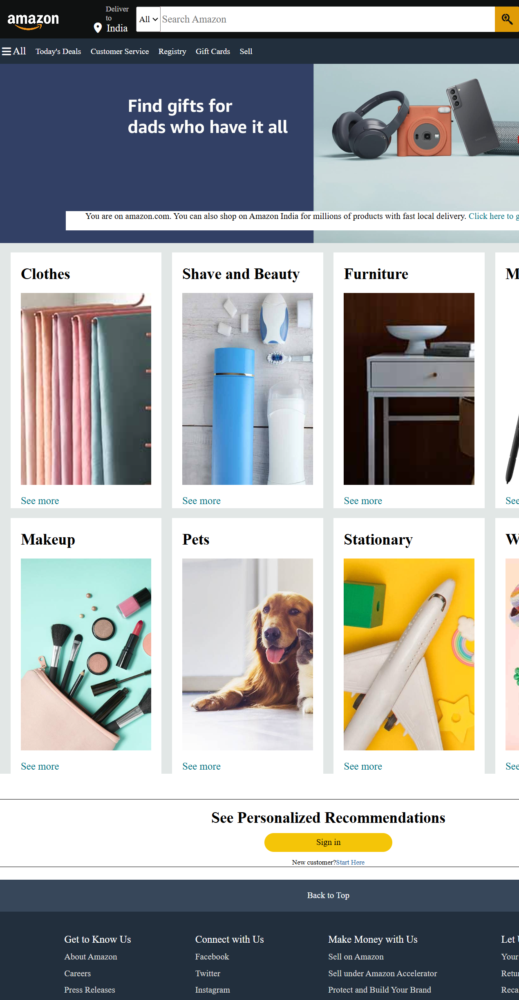

# 🛒 Amazon Clone

A visually appealing front-end clone of **Amazon** built using HTML, CSS.  
Designed to closely match the look and feel of Amazon’s interface with responsive design.

---

## 🚀 Features
- 📱 **Responsive Design** – Works on desktop and mobile.
- 🛍️ **Product Listings** – Display product images, names, and prices.
- 🔍 **Search Bar** – Amazon-style search layout.
- 🎨 **Custom Styling** – Theme inspired by Amazon's UI.

---

## 🛠 Tech Stack
| Technology | Purpose |
|------------|---------|
| **HTML5**  | Structure of the website |
| **CSS3**   | Styling and layout |

---

## 📸 Screenshots
Example:


---

## 📦 Installation
```bash
# Clone the repository
git clone https://github.com/SHUBHAM-5G/Amazon-Clone.git

# Open the project folder
cd Amazon-Clone

# Open in your browser
start index.html   # Windows
open index.html    # Mac
👨‍💻 Author

Shubham Gour
📌 GitHub
⭐ If you like this project, give it a star on GitHub!
